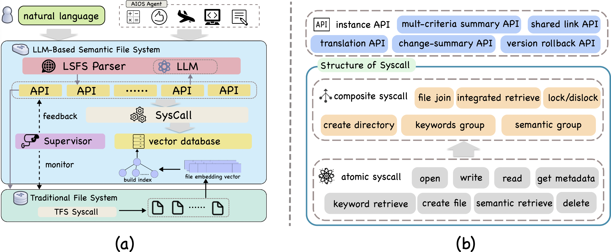

# AIOS-LSFS
From Commands to Prompts: LLM-based Semantic File System for AIOS

## 🏠 Architecture of LSFS
<p align="center">

</p>

## 🚀 Quickstart

### Installation
```
conda create -n lsfs-venv python=3.11
conda activate lsfs-venv
pip install -r requirements.txt
```

### Run
Set up your OPENAI API Key and run the following command
```
python main.py --llm_name gpt-4o-mini # use gpt-4o-mini by default
```
